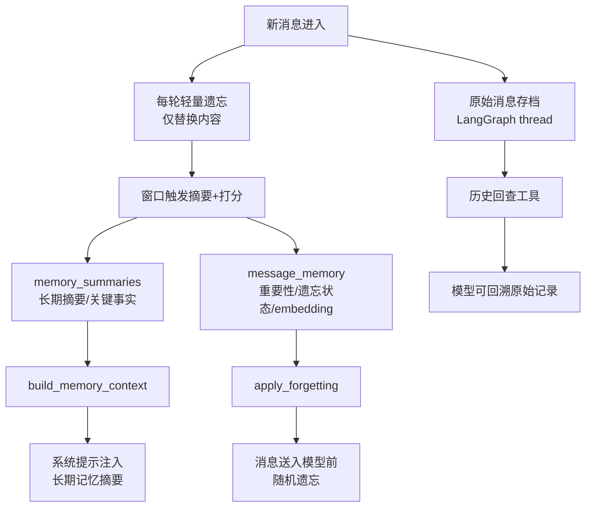

# 上下文压缩方案（讨论稿）

目标：在不影响用户可见历史的前提下，压缩模型上下文，提高稳定性与成本可控性。

---

## 一、核心原则

1. **用户看到完整历史**：UI 始终展示原始记录，不做删除。
2. **模型上下文可压缩**：仅对“送入模型的上下文”做压缩/遗忘。
3. **随机删除仅删内容**：不删除消息位置；被遗忘的内容替换为“已忘记”占位。
4. **硬兜底 token 阈值**：兜底触发时，使用“随机遗忘”保证最终 token 不超限。

---

## 二、触发策略

1. **每轮轻量遗忘（默认）**  
   - 每次新消息到来都执行一次小幅遗忘（概率较低、幅度较小）  
   - 模拟“聊天过程中自然遗忘”的人类行为  

2. **token 兜底（硬性）**  
   - 当上下文接近上限（例如 80% / 90%），强制压缩  
   - 兜底策略仍使用“随机遗忘”，但加大遗忘力度  

3. **时间加速遗忘（长时间未聊）**  
   - 长时间无对话时，遗忘比例上升  
   - 模拟“时间越久，遗忘越多”的人类记忆衰退

4. **夜间整理（增量整理 + 权重刷新）**  
   - 只整理当天新增窗口（或最近 N 条），不做全量重摘要  
   - 合并进长期摘要 / 档案  
   - 刷新重要性分数与遗忘权重  
   - 生成记忆变更日志（新增/更新/遗忘）

---

## 三、摘要形态

**摘要正文（一段话）**  
用于模型理解当前用户状态与近期任务进展。

**教练注意点（可选结构化）**  
- 伤病/限制  
- 训练偏好  
- 关键目标

---

## 四、随机遗忘策略（只删内容，不删位置）

### 1. 约束规则

- **最近 N 条消息完全保留**（例如 N=10）
- 其余历史进入“候选删除池”
- 删除方式为：**替换内容为“已忘记”**
- **工具消息过滤**：最近窗口之外的 `mark_task_done` 工具消息直接过滤（不参与上下文）

> 说明：可以把“最近窗口 N 条”作为**摘要与打分的触发窗口**。例如每当累计新增 N 条消息，就触发一次摘要更新与消息打分（完成“完善结构化记忆 + 打分”两件事）。

### 2. 权重来源

1. **重要性权重（模型打分）**  
   - 重要性高 → 删除概率低  
2. **时间权重（系统计算）**  
   - 越旧 → 删除概率高  
3. **随机因子（系统采样）**  
   - 用于模拟人类记忆稀疏性

### 3. 删除过程（兜底 token）

1. 计算当前上下文 token  
2. 保留最近 N 条  
3. 对候选池计算权重  
4. 按权重随机替换内容  
5. 直到 token 满足目标阈值

> 删除策略的本质是“保留结构、稀疏内容”，确保上下文不突变。

---

## 五、存档与回查

1. **原始记录存档**：完整对话保存在 Postgres  
2. **模型可回查**：提供检索工具（时间范围/关键词/主题）

---

## 六、记忆变更日志（模型感知）

每次摘要或遗忘，生成一段“变更说明”供模型理解：  

```
记忆更新：
- 新增：目标为减脂
- 更新：膝盖疼痛从偶发→持续
- 删除：早期闲聊（已归档，可检索）
```

---

## 七、待确认问题

1. 语义切断点的定义规则（规则触发 vs 模型判定）
2. 重要性打分的尺度与阈值（1-5？1-10？）
3. token 兜底的目标阈值（80% / 90% / 95%）
4. “已忘记”占位的具体文案

---

## 八、摘要触发（待确定）

摘要常规触发方式：**每累计 N 条消息触发一次摘要与打分**（窗口触发，见上文说明）。

可选的补充触发：
1. **夜间整理**  
   - 对当天新增窗口做增量摘要与权重刷新  
2. **关键事实变更**  
   - 模型检测到重大变化时追加摘要变更记录  

---

## 九、实现步骤（当前实现）

1. **新增旁路表（Alembic）**  
   - `memory_summaries`：存长期摘要、关键事实、窗口游标  
   - `message_memory`：存消息打分与遗忘状态  

2. **内存模块（`fit_agent/memory.py`）**  
   - `build_memory_context()`：组装“长期记忆摘要 + 注意点”  
   - `apply_forgetting_to_messages()`：对历史消息按权重随机遗忘（仅替换内容）  
   - `update_memory_for_window()`：每 N 条窗口触发摘要更新 + 消息打分  
   - **可选嵌入**：设置 `MEMORY_EMBEDDING_MODEL` 时，为消息生成 embedding 并存入旁路表  

3. **节点注入（`fit_agent/nodes.py`）**  
   - LLM 调用前：加载长期记忆并注入 SystemMessage  
   - LLM 调用前：对输入消息执行随机遗忘  
   - LLM 调用后：异步触发窗口摘要与打分更新  

4. **可回查存档**  
   - 原始消息仍由 LangGraph thread 存储  
   - 记忆旁路表只用于打分/遗忘/摘要

---

## 十、记忆设计图（Mermaid）



