# FitFlow AI 私教 · 产品讨论与验证

> 本文档记录产品定位、功能验证及发展方向的讨论过程，用于验证产品 idea 的可行性。  
> 产品规格详见 [fitter/docs/PRODUCT_SPEC.md](../fitter/docs/PRODUCT_SPEC.md)
>
> **图表说明**：本文档使用 Mermaid 和 PlantUML 进行可视化，便于在支持渲染的编辑器中查看（如 VS Code + 插件、GitHub、Notion 等）。

---

## 文档总览

```
FitFlow 产品讨论
│
├── 一 关键要素（核心）
│   ├── 数据与对话深度打通 [P0] …… AI 能读能写计划/历史/PR/容量，对话中自然引用；「懂你」的前提
│   ├── 陪练场景体验 [P0] …… 训练中实时引导、计时、调整，理解上下文；坚持+进步的核心杠杆
│   ├── 可执行决策 [P0] …… 改计划、写记录、安排任务，用户少动手；可执行=信任
│   ├── 主动时机 [P1] …… 正确时机提醒、监督；解决坚持问题
│   ├── 健康收益可验证 [P1] …… 用数据证明帮助坚持、进步；产品能否走远的终极判断
│   ├── 垂直做深 [P2] …… 力量训练/私教场景极致深度；深度=护城河
│   └── 速度 [贯穿] …… 抢窗口期完成 M1、M2
│
├── 二 产品定位
│   ├── 核心 …… 主动的、数据驱动的智能私教，非被动应答
│   ├── 一句话 …… 拥有用户训练数据，在正确时机给出可执行的决策
│   └── vs 通用 AI（豆包/千问）
│       ├── 数据：每次需重新描述 → 持续维护训练/饮食/评估
│       ├── 时机：用户主动问 → 主动提醒、监督
│       ├── 输出：文字建议 → 可执行决策（改计划、写记录）
│       └── 角色：被动应答 → 主动规划、陪练、评估、激励
│
├── 三 市场与趋势
│   ├── 市场空间 …… 健身 App 106→336 亿$（CAGR 13.5%）；AI 健身 28→253 亿$（CAGR 27.6%）
│   ├── 需求持续 …… 成本可及性、个性化、技术成熟、健康意识
│   ├── 挑战 …… 留存（Keep 30 日约 54%）、免费内容竞争
│   ├── 趋势 …… AI 个性化、可穿戴、计算机视觉、语音、垂直化
│   └── 启示 …… 垂直做力量训练/私教比泛健身有机会
│
├── 四 竞品与差异化
│   ├── 国际 AI 私教 …… FitnessAI(BodyScan)、Planfit(Max)、Motra(AW 自动追踪)、Shred(CoachAI)
│   ├── 国际 动作评估 …… Gymscore(0-100 评分、1500+ 动作)
│   ├── 国际 记录+AI …… Hevy(1100 万)、Nike、Aaptiv
│   ├── 国内 …… Keep(4 亿、卡卡)、咕咚(2 亿)、悦跑圈、魔训、训记、豆包/千问
│   ├── 个人助理 …… OpenClaw：同逻辑（了解用户后帮助做事），已有健身技能
│   ├── 魔训 vs FitFlow …… 魔训=计划+分析+线下真人，无对话陪练；FitFlow=AI 当陪练
│   └── FitFlow 差异化 …… 数据持久化、可执行决策、主动时机、Show+社交
│
├── 五 功能验证（健康收获为核心）
│   ├── 健康收益五维度 …… 坚持、进步、安全、认知、心理
│   ├── 陪练 …… 贡献坚持+进步；先文本+计时，再语音；待验证完成率
│   ├── 动作评估 …… 贡献安全+进步；照片/视频(中)→实时(高)；可接 Gymscore
│   ├── 计划+记录 …… 基础设施；已有 MVP；数据与 Agent 打通待完善
│   ├── Show …… 日历图、卡片、年终视频；贡献坚持+心理
│   ├── 训练搭子 …… AI 陪两人练；待验证需求
│   ├── 认知引导 …… 跨功能；解释「为什么」、探询真实目标
│   └── 验证优先级 …… P0 计划+陪练 → P1 认知+Show → P2 动作评估+搭子
│
├── 六 发展路径
│   ├── 阶段一 …… 聊天入口 + 数据打通
│   ├── 阶段二 …… 陪练（文本→语音）
│   ├── 阶段三 …… 动作评估（照片/视频）
│   ├── 阶段四 …… Show（日历图、卡片、年终视频）
│   ├── 阶段五 …… 训练搭子（待验证）
│   ├── M1 …… 数据打通，对话可改计划、补记录
│   ├── M2 …… 陪练可用，「今天开始训练」完整走通
│   ├── M3 …… Show 可分享
│   └── M4 …… 动作评估有价值
│
├── 七 结论与延伸
│   ├── 验证结论 …… 有潜力；优先 M1+M2；数据+决策+主动是差异化
│   ├── 下一步 …… 完成 M1、设计陪练 MVP、准备内测
│   ├── 盈利途径
│   │   ├── 主路径 …… 订阅制，与持续服务定位一致
│   │   ├── 降门槛 …… Freemium：免费基础陪练/计划/记录，付费主动/评估/Show
│   │   └── 核心逻辑 …… 盈利依赖用户健康收获
│   └── AI 准确性与客观性
│       ├── 顾虑 A …… AI 难达真值，正反皆可辩
│       │   └── 应对 …… 数据优先、规则+模型、原则锚定、坦诚不确定性
│       ├── 顾虑 B …… 健身无唯一正确答案
│       │   └── 应对 …… 目标+约束、迭代优化、透明表达；动作评估相对客观
│       └── 定位 …… 「合理方案+持续优化」非「唯一正确答案」
│
├── 八 共创者洞察
│   ├── 认知弯路 …… 6 年才懂饮食+形体；认知引导是差异化
│   ├── 私教价格 …… 真人贵且难持续；AI 长期陪伴、数据、标准化是价值
│   └── 效果担忧 …… 动作/情绪 AI 有短板；监督/数据 AI 有优势；卖色相与训练效果是不同需求
│
├── 九 产品哲学
│   ├── 摧毁 vs 服务 …… 光谱非二元；同一技术可兼有
│   ├── 更可操作 …… 追问「以人为目的 vs 以人为手段」
│   └── FitFlow 选择 …… 以人为目的；帮人更自主达成目标
│
└── 十 风险点
    ├── 大厂降维 [高] …… 豆包补齐数据+决策；应对：抢时间、做深垂直、数据飞轮
    ├── OpenClaw [高] …… 同逻辑，已有健身技能；应对：做深垂直、考虑作技能接入
    ├── 技术成本 [中] …… 动作评估、语音有门槛；应对：分阶段、借力 API
    ├── 用户习惯 [中] …… 从「问一句答一句」到「让 AI 主动管」；应对：默认温和、场景聚焦
    └── 魔训 AI [中] …… 若增强对话陪练会竞争；应对：明确 AI 陪练 vs 计划+线下
```

---

## 一、FitFlow 做出成绩的关键要素（核心）

> 在豆包、Keep、FitnessAI、Planfit、OpenClaw、魔训等竞品包围下，FitFlow 要做出成绩，需在以下要素上做到位。

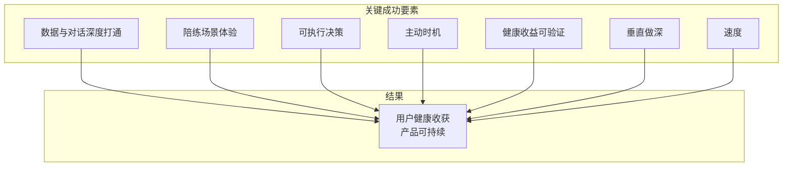

| 要素 | 含义 | 优先级 |
|------|------|--------|
| **数据与对话深度打通** | AI 能读能写训练/饮食/评估数据，对话中自然引用 | P0 |
| **陪练场景体验** | 训练中实时引导、计时、调整，理解训练上下文 | P0 |
| **可执行决策** | 改计划、写记录、安排任务，用户少动手 | P0 |
| **主动时机** | 正确时机提醒、监督，解决坚持问题 | P1 |
| **健康收益可验证** | 用数据证明帮助用户坚持、进步 | P1 |
| **垂直做深** | 力量训练/私教场景做到极致深度 | P2 |
| **速度** | 抢在窗口期内完成 M1、M2 | 贯穿 |

**一句话**：在「数据+陪练+可执行+主动」上做到**可用且可验证**，用**健康收益**证明价值，在**力量训练/私教**场景做深，并**抢在窗口期内**完成。

---

#### 要素详述

| 要素 | 含义 | 竞品对比 | 关键 |
|------|------|----------|------|
| **数据与对话深度打通** | AI 能读能写计划/历史/PR/容量，对话中自然引用 | 豆包无；Keep 待观察；OpenClaw 依赖技能 | 「懂你」的前提 |
| **陪练场景体验** | 训练中实时引导、计时、调整，理解上下文 | Planfit/Shred/Keep 有；FitFlow 与计划/记录深度绑定 | 坚持+进步的核心杠杆 |
| **可执行决策** | 改计划、写记录、安排任务，用户少动手 | 豆包只建议；训记/Hevy 无 | 可执行 = 信任 |
| **主动时机** | 正确时机提醒、监督 | 多数弱或无 | 解决坚持问题 |
| **健康收益可验证** | 用数据证明帮助坚持、进步 | 多数未公开 | 产品能否走远的终极判断 |
| **垂直做深** | 力量训练/私教场景极致深度 | 通用产品难做深 | 深度 = 护城河 |
| **速度** | 抢窗口期完成 M1、M2 | — | 窗口期有限 |

**要素优先级**：P0 数据打通+陪练+可执行 → P1 主动+健康验证 → P2 垂直做深；速度为贯穿。

---

## 二、产品定位回顾

### 2.1 核心定位

**AI 私教 / AI 训练专家** —— 主动的、数据驱动的智能私教，而非被动应答的聊天助手。

### 2.2 与通用 AI 助手的核心差异

| 维度 | 豆包 / 千问 等 | FitFlow AI 私教 |
|------|----------------|-----------------|
| 数据 | 每次对话需重新描述 | 持续维护用户的训练、饮食、评估数据 |
| 时机 | 用户主动提问 | 在合适时机主动提醒、监督 |
| 输出 | 文字建议 | 可执行的决策（改计划、调重量、安排任务） |
| 角色 | 被动应答 | 主动规划、陪练、评估、激励 |

**一句话**：拥有用户的训练数据，在正确时机给出可执行的决策。

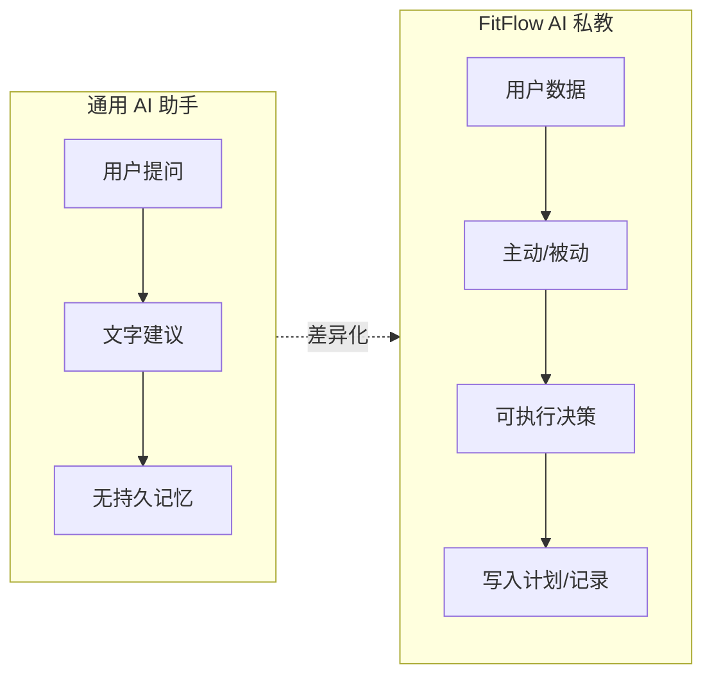

---

## 三、市场与趋势验证

### 3.1 市场空间

- **健身 App 市场**：2024 年约 106 亿美元，预计 2033 年达 336 亿美元，CAGR 约 13.5%
- **AI 健身教练细分**：2024 年约 28 亿美元，预计 2033 年达 253 亿美元，CAGR 约 27.6%
- **用户规模**：2024 年健身 App 用户约 3.45 亿，下载量约 8.5 亿

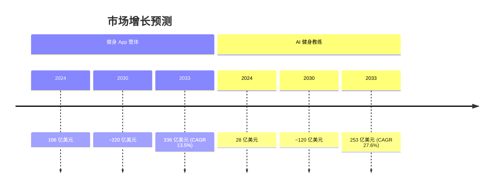

### 3.2 市场需求是否持续增长？

**结论**：是。支撑长期需求的因素如下：

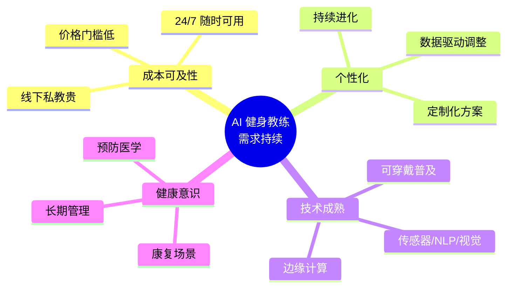

**需关注的挑战**：用户留存（Keep 30 日留存约 54%）、免费内容竞争。FitFlow 的「数据 + 主动 + 决策」正是为解决留存而设计。

### 3.3 关键趋势

1. **AI 个性化**：基于数据的个性化、实时调整是主要驱动力
2. **可穿戴整合**：与 Apple Watch、Garmin 等设备联动
3. **计算机视觉**：动作识别、姿态估计、动作纠正
4. **语音交互**：语音指导、自然语言理解
5. **垂直化**：从通用方案转向细分场景（康复、团课、特定人群）

### 3.4 对 FitFlow 的启示

- 市场在增长，AI 健身是明确方向
- 「数据驱动 + 个性化」与 FitFlow 定位高度一致
- 动作评估、语音陪练是差异化能力，但技术门槛高
- 垂直做「力量训练 / 私教」比泛健身更有机会

---

## 四、竞品与差异化

### 4.1 竞品全景（广泛调研）

#### 国际：AI 私教型

| 竞品 | 核心能力 | 定价 | 短板 |
|------|----------|------|------|
| **FitnessAI** | 百万级数据、BodyScan 身体成分、自动调重量、健身房/居家/混合 | YC 背书，$1M+ ARR | 偏计划生成，陪练/社交弱 |
| **Planfit** | AI 教练 Max（ChatGPT）、个性化计划、动作库、肌肉恢复监测 | 免费+订阅 | 1M+ 用户，偏入门，教练感中等 |
| **Motra** | Apple Watch 自动追踪 470+ 动作、Neural Kinetic Profiling、无需手动记录 | 订阅制 | 需 Apple Watch，偏追踪 |
| **Shred** | CoachAI 语音陪练、双向对话、精英教练周期计划、自适应 AI | $10–20/月 | 2025 年才推 CoachAI，较新 |
| **JuggernautAI** | 力量/举重专用、周期化、每日准备度评估、疲劳监控 | $35/月 | 垂直举重，受众窄 |
| **SensAI** | LLM 对话教练、可穿戴整合、实时健康信号（HRV/睡眠）驱动计划 | 订阅制 | iOS 先行，500+ 内测 |
| **Fitbod** | 智能肌肉恢复追踪、渐进超负荷优化、器械灵活 | $13/月 | 偏计划工具，对话弱 |
| **Freeletics** | 自重训练、AI 定制、实时反馈 | 订阅制 | 偏自重，无器械 |
| **Whoop Coach** | 可穿戴数据（心率/恢复/睡眠）驱动的超个性化每日指导 | 需 Whoop 设备 | 硬件绑定 |

#### 国际：动作评估型

| 竞品 | 核心能力 | 定价 | 短板 |
|------|----------|------|------|
| **Gymscore** | 计算机视觉动作分析、0–100 技术评分、1500+ 动作、即时纠正 | 订阅制 | 专注 form，非全流程教练 |

#### 国际：记录型 + AI

| 竞品 | 核心能力 | 定价 | 短板 |
|------|----------|------|------|
| **Hevy** | 1100 万用户、训练记录、Hevy Trainer 自适应计划、社交/分享 | 免费+Pro | AI 为辅助，非核心 |
| **Nike Training Club** | AI 增强计划、专业内容 | 免费 | 品牌主导，AI 深度一般 |
| **Aaptiv** | AI 推荐 + 真人音频课程，跑步/HIIT | 订阅制 | 偏有氧，非力量 |

#### 国内

| 竞品 | 核心能力 | 短板 |
|------|----------|------|
| **Keep** | 4 亿用户、AI 教练卡卡、Kinetic.ai 自研模型、智能方案/语音指导/图片识别/数据解读 | 大而全，AI 与数据打通深度待观察 |
| **咕咚** | 2 亿用户、配速兔子 AI、多品牌手表、赛事/社交 | 偏跑步，力量训练弱 |
| **悦跑圈** | AI 智能记录、心率、个性化推荐、跑步社交 | 偏跑步 |
| **魔训** | 个性化计划、肌肉档案等级、**线下私教预约**、打卡挑战、HIIT/力量/核心（成都明意志） | **双重专业指导**：线上智能分析+线下真人；AI 为计划+分析，无对话陪练 |
| **训记** | 力量训练硬核记录、容量计算、自定义计划、动作库、月报、云端同步、永久会员 ¥88 | 纯工具型，无 AI 教练，偏记录 |
| **豆包 / 千问** | 通用 AI，可制定计划、语音指导 | 无持久数据、无主动提醒、输出为建议非决策 |

### 4.2 竞品分类与 FitFlow 定位

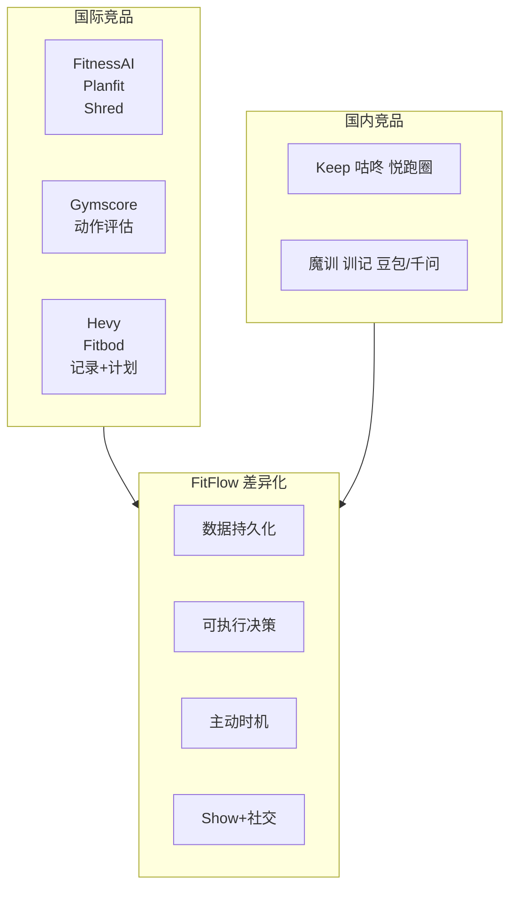

### 4.3 FitFlow 的差异化空间

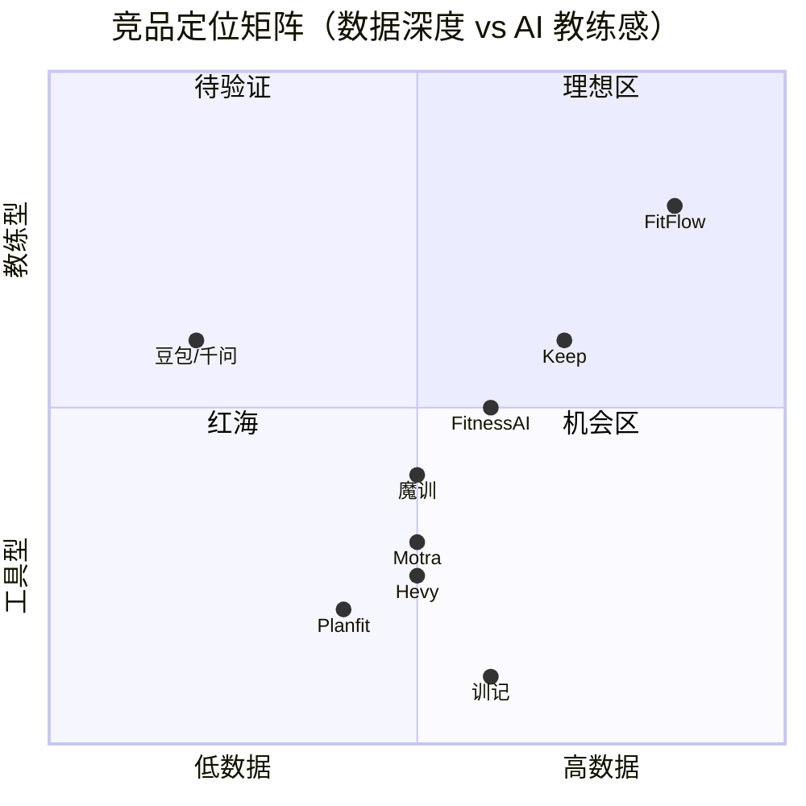

1. **数据持久化**：训练、饮食、评估长期积累，形成「懂你」的私教
2. **可执行决策**：不只给建议，而是改计划、写记录、安排任务
3. **主动时机**：提醒、监督、在合适时机介入
4. **Show 与社交**：日历图、训练卡片、年终总结、训练搭子 —— 满足展示与社交需求

### 4.4 竞品能力对比（FitFlow 视角）

| 能力 | Keep | 魔训 | 训记 | FitnessAI | Planfit | Motra | Gymscore | FitFlow 目标 |
|------|------|------|------|-----------|---------|-------|----------|--------------|
| 持久数据 | 有 | 有 | 有 | 有 | 有 | 有 | 有 | 有，且与对话深度打通 |
| 可执行决策 | 待观察 | 计划调整 | 无 | 计划调整 | 计划调整 | 计划调整 | 无 | 改计划、写记录、安排任务 |
| 主动提醒 | 有 | 打卡挑战 | 无 | 弱 | 弱 | 弱 | 无 | 核心能力 |
| 动作评估 | 图片识别 | 无 | 无 | BodyScan | 动作库 | 无 | 强 | 照片/视频，分阶段 |
| 陪练/对话 | 语音 | 无 | 无 | 弱 | ChatGPT | 弱 | 24/7 聊天 | 实时陪练，理解训练上下文 |
| Show 分享 | 有 | 勋章 | 月报 | 弱 | 弱 | 弱 | 无 | 日历图、卡片、年终视频 |
| 训练搭子 | 无 | **有** | 无 | 无 | 无 | 无 | 无 | 待验证 |

> **魔训**：核心为「双重专业指导」——线上智能分析（计划+肌肉档案）+ 线下真人私教。AI 是计划+分析工具，无对话陪练。**训记**：纯记录工具，无 AI，硬核力量训练用户常用。

### 4.5 魔训的 AI 教练定位 vs FitFlow

**魔训的核心定位**：**双重专业指导**——线上智能分析 + 线下真人私教。搭子系统是附加功能，非核心。

| 维度 | 魔训 AI 教练 | FitFlow AI 私教 |
|------|--------------|-----------------|
| **线上能力** | 个性化计划、肌肉档案等级、智能体能跟踪、打卡挑战 | 数据驱动计划、**对话陪练**、**可执行决策**、**主动提醒** |
| **AI 形态** | 计划生成 + 数据分析，无对话陪练 | 对话式 AI，理解训练上下文，可改计划/写记录 |
| **线下** | **可预约真人私教**，1 对 1 定制 | 纯线上（或未来可扩展） |
| **商业模式** | 线上免费/订阅 + 线下私教抽成 | 待定 |

**魔训的 AI 教练定位**：

- **线上**：根据身体状况和目标生成计划、肌肉档案等级追踪进度、多维度数据分析。本质是「智能计划 + 数据看板」，**无 AI 对话、无实时陪练**。
- **线下**：用真人私教补足动作纠正、现场反馈、情绪价值。用户若需要深度指导，需付费约课。

**对 FitFlow 的启示**：

1. **魔训 = 计划+分析+线下真人**，FitFlow = **计划+对话陪练+可执行决策**。魔训的 AI 不「陪练」，FitFlow 的 AI 是陪练主体。
2. 魔训的线上线下混合是成熟模式，但依赖线下私教供给和用户付费意愿。FitFlow 的纯线上 AI 陪练可覆盖「不想/不能持续请真人」的用户。
3. 若魔训未来增加 AI 对话陪练，会与 FitFlow 直接竞争；目前其 AI 定位偏「工具+分析」，与 FitFlow 的「教练」定位有区隔。

### 4.6 风险点（展开）

以下四个风险对 FitFlow 的生存与发展至关重要，需持续关注并制定应对策略。

---

#### 风险一：大厂补齐「数据 + 决策」形成降维打击

**现状**：豆包、千问等通用 AI 已有健身计划制定、语音指导能力，但**无持久数据**、**无主动提醒**、**输出为建议非决策**。这正是 FitFlow 的差异化空间。

**风险**：若大厂补齐这两块，会发生什么？

| 大厂优势 | 对 FitFlow 的影响 |
|----------|-------------------|
| **用户规模** | 豆包/千问 MAU 数亿，获客成本极低；FitFlow 需从零积累 |
| **技术资源** | 自研模型、多模态、语音、视觉可快速迭代 |
| **生态整合** | 与手机、手表、健康 App 深度打通，数据天然可得 |
| **免费策略** | 可长期免费提供基础能力，挤压垂直 App 付费空间 |

**关键问题**：大厂**会不会**补齐？**何时**补齐？

- **动力**：健身是高频、高价值场景，大厂有动机做深
- **阻力**：大厂优先服务通用场景，垂直场景需产品、运营、数据积累，非简单技术问题；健身数据涉及隐私，用户未必愿意交给大厂
- **时间窗口**：从「有想法」到「数据打通 + 可执行决策 + 主动提醒」产品化，至少需 6–12 个月；FitFlow 有窗口期

**应对策略**：

1. **抢时间**：尽快完成 M1（数据打通）、M2（陪练），形成可验证的差异化体验
2. **做深垂直**：在「力量训练 / 私教」场景做到极致，大厂难以在通用产品里做到同等深度
3. **积累数据飞轮**：用户越多，数据越多，AI 越准，体验越好——形成护城河
4. **考虑合作**：若大厂开放生态，FitFlow 可作为「健身垂直能力」接入，而非正面竞争

---

#### 风险二：动作评估、实时陪练的技术与成本

**现状**：动作评估需计算机视觉（姿态估计、动作识别），实时陪练需语音 ASR/TTS、低延迟、训练上下文理解。这些都有技术门槛和实现成本。

**风险拆解**：

| 能力 | 技术依赖 | 成本/难度 | 说明 |
|------|----------|-----------|------|
| **动作评估（照片/视频）** | 视觉模型、姿态估计 | 中 | 可接入第三方 API（如 Gymscore SDK）；自研需标注数据、模型训练 |
| **动作评估（实时）** | 实时视频流、边缘推理 | 高 | 延迟、功耗、隐私都是挑战 |
| **语音陪练** | ASR + TTS + 唤醒词 | 中 | 智谱等已有方案；需优化延迟、自然度 |
| **训练上下文理解** | 计划/记录数据结构化 + LLM | 中 | 依赖数据层设计，FitFlow 已有基础 |

**关键问题**：在资源有限时，**先做哪块**？**做到什么程度**？

- **分阶段**：先做文本陪练 + 计时（不依赖视觉/语音），验证价值；再上照片/视频评估；最后考虑实时、语音
- **借力**：动作评估可优先对接 Gymscore 等现成能力，而非从零自研
- **成本控制**：视觉/语音 API 按调用计费，需设计用量策略（如每日免费次数、会员无限）

**应对策略**：

1. **MVP 不依赖高成本能力**：M1、M2 以文本 + 数据为主，可快速验证
2. **技术选型务实**：优先用成熟 API，自研只在关键差异化点
3. **分阶段投入**：动作评估、语音按用户反馈和留存数据决定优先级

---

#### 风险三：用户习惯——从「问一句答一句」到「让 AI 主动管我」

**现状**：用户已习惯用豆包/千问「问一句答一句」。FitFlow 的差异化是**主动提醒、监督**——在合适时机介入，而非等用户来问。这是**行为习惯的转变**。

**风险**：

| 维度 | 挑战 |
|------|------|
| **心理** | 部分用户对「被管」有抵触，觉得侵犯自主权 |
| **信任** | 用户需相信 AI 的提醒是「对的时机」，而非骚扰 |
| **习惯** | 主动提醒需用户开启、授权，很多人不会主动设置 |
| **预期** | 若提醒不准（如在不合适时推送），会损害信任 |

**关键问题**：用户**愿不愿意**被 AI 主动管？**在什么场景下**愿意？

- **愿意的场景**：训练日提醒、休息结束提醒、饮食打卡提醒——这些是「帮用户执行计划」，而非说教
- **不愿意的场景**：频繁推送、与用户意图冲突的「建议」
- **设计原则**：主动 = **在用户已有意图的基础上推一把**，而非强加新意图

**应对策略**：

1. **默认温和**：初期主动提醒频率低、可关闭、可自定义时段
2. **场景聚焦**：先做「训练日提醒」「组间休息提醒」等明确有价值的场景
3. **用户教育**：在 Onboarding 中解释「主动提醒能帮你坚持」，并让用户选择是否开启
4. **数据验证**：用 A/B 测试看「有主动提醒」vs「无」的留存、完成率差异

---

#### 风险四：魔训的 AI 教练定位——线上线下混合 vs FitFlow 纯线上

**现状**：魔训的 AI 教练定位是**双重专业指导**——线上智能分析（计划+肌肉档案+数据） + 线下真人私教。其 AI 是「计划生成 + 分析工具」，**无对话陪练**。搭子是附加功能，非核心。

**风险**：

| 维度 | 魔训 AI 教练 | FitFlow AI 私教 |
|------|--------------|-----------------|
| **AI 形态** | 计划+分析，无对话 | 对话陪练、可执行决策 |
| **线下** | 可预约真人私教 | 纯线上 |
| **优势** | 真人补足动作/情绪/现场反馈 | 7×24、低成本、数据驱动 |
| **劣势** | 依赖私教供给、持续付费 | 动作/情绪不如真人 |

**关键问题**：魔训若**增强 AI 能力**（如增加对话陪练、可执行决策），会与 FitFlow 直接竞争。若其保持「计划+分析+线下」模式，则与 FitFlow 的「纯线上 AI 陪练」是不同路径。

**应对策略**：

1. **明确差异化**：FitFlow = 「AI 当陪练」，魔训 = 「AI 当工具 + 真人当教练」。两者服务不同用户偏好。
2. **关注魔训动向**：若其上线 AI 对话/陪练，需快速响应，强化 FitFlow 的深度（数据、决策、主动）。
3. **优先 M1、M2**：单人陪练、数据打通是基础，先做深再做广。

---

#### 风险五：OpenClaw 等个人助理——同逻辑的更深层竞争

**用户洞察**：相比豆包，更担心 **OpenClaw** 这类产品——因为核心逻辑相同：**个人助理，在充分了解用户信息后帮助做事**。

**OpenClaw 简介**：

- 开源、本地优先的 24/7 个人 AI 助手（25 万+ GitHub stars）
- **持久记忆**：跨会话保留上下文，学习用户偏好、工作流
- **可执行**：不只聊天，能浏览网页、读写文件、运行命令、发邮件、管理日历
- **主动**：后台心跳、定时任务、自主决策，无需提示即可执行
- **技能生态**：1000+ 社区技能，用户可自建；AI 可根据视频/笔记自动编写技能
- **定价**：$39.9–89.9/月

**与 FitFlow 的相同逻辑**：

| 维度 | FitFlow | OpenClaw |
|------|---------|----------|
| 核心逻辑 | 了解用户训练/饮食/评估数据 → 帮助做事 | 了解用户全面信息 → 帮助做事 |
| 持久数据 | ✓ | ✓ |
| 可执行决策 | 改计划、写记录、安排任务 | 发邮件、管理日历、运行命令等 |
| 主动 | 提醒、监督 | 定时任务、自主决策 |
| 垂直 | 健身 | 通用（可扩展技能） |

**已有健身相关技能**：workout-logger（记录、PR、进度）、fitnesscoach-teneo（计划、TDEE、宏量）、garmin-health-analysis（可穿戴数据）。生态可快速扩展。

**风险**：

- OpenClaw + 健身技能 可覆盖 FitFlow 的「数据 + 决策 + 主动」逻辑
- 用户若已有 OpenClaw，可能倾向用「健身技能」而非单独装 FitFlow
- OpenClaw 是**平台**，FitFlow 是**垂直产品**——平台可吸收垂直能力

**应对策略**：

1. **做深垂直**：在「力量训练 / 私教」场景做到 OpenClaw 通用技能难以达到的深度——专业计划、陪练上下文、动作评估、Show 等
2. **考虑 FitFlow 作为 OpenClaw 技能**：若 OpenClaw 生态成熟，FitFlow 可作为健身技能接入，服务「已有 OpenClaw 且要健身」的用户
3. **差异化叙事**：FitFlow = 「健身专用」；OpenClaw = 「通用助理 + 健身是技能之一」。专注健身的用户可能更偏好专用产品
4. **关注同类产品**：除 OpenClaw 外，关注其他「个人助理 + 持久数据 + 可执行」的竞品（如 AI 原生日历、任务管理工具等）

---

#### 风险小结

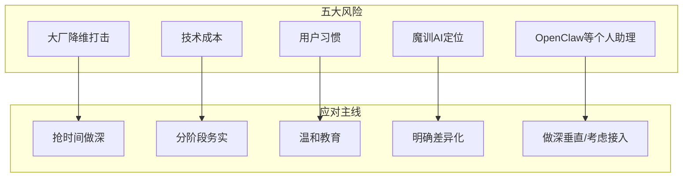

| 风险 | 紧迫度 | 应对主线 |
|------|--------|----------|
| 大厂降维打击 | 高 | 抢时间、做深垂直、积累数据飞轮 |
| **OpenClaw 等个人助理** | **高** | 做深健身垂直、考虑作为技能接入、专注健身用户 |
| 技术成本 | 中 | 分阶段、借力 API、MVP 不依赖高成本能力 |
| 用户习惯 | 中 | 默认温和、场景聚焦、数据验证 |
| 魔训 AI 教练 | 中 | 明确「AI 陪练 vs 计划+线下」差异化、关注其 AI 增强动向 |

### 4.7 竞品功能纵览对比表

> 以下为所有提及产品的功能与特色卖点纵览，统一在一表内，分类作为首列便于筛选。

| 分类 | 产品 | 定价 | 计划生成 | 数据记录 | 动作/身体评估 | 陪练/对话 | 可穿戴 | 特色卖点 |
|------|------|------|----------|----------|---------------|-----------|--------|----------|
| 国际 AI 私教 | **FitnessAI** | 订阅 | ✓ 590 万+ 训练数据驱动、自动调重量/组次 | ✓ | **BodyScan**：手机 3D 身体成分（体脂/肌肉/腰围），类 DEXA | 弱 | Apple Health | YC 背书、$1M+ ARR；健身房/居家/混合 |
| 国际 AI 私教 | **Planfit** | 免费+订阅 | ✓ AI Max（ChatGPT）根据目标/水平/器械 | ✓ 8000 万+ 训练、肌肉恢复、热量 | 数百动作视频+呼吸/技巧 | **Max 实时指导**、组间倒计时、休息管理 | Apple Watch | 1M+ 用户、4.8 星；入门友好 |
| 国际 AI 私教 | **Motra** | 订阅 | ✓ Smart Weights 根据恢复/目标 | **全自动**：AW 识别 470+ 动作，零手动 | 无 | 弱 | **需 Apple Watch S4+** | **Neural Kinetic Profiling**；5 次训练后学习用户模式 |
| 国际 AI 私教 | **Shred** | $10–20/月 | ✓ 精英教练周期、自适应组次/休息/强度 | ✓ | 无 | **CoachAI 语音陪练**+**Chat**（饮食/恢复/睡眠） | Apple Watch | 2025 CoachAI；器械灵活；学生/医护折扣 |
| 国际 AI 私教 | **JuggernautAI** | $35/月 | ✓ 10+ 万亿周期化、PowerCombo 力量+增肌 | ✓ MEV/MRV 个体化 | 无 | 弱 | 可整合 | **举重专家**；**每日准备度评估**；JTS 团队 |
| 国际 AI 私教 | **SensAI** | 订阅 | ✓ LLM、HRV/睡眠/恢复实时调整 | ✓ 图表、成就徽章 | 实时动作纠正 | **对话式 AI 教练**、自然语言讨论健康数据 | AW/Garmin/Oura/Fitbit | 多可穿戴；500+ 内测；iOS 先行 |
| 国际 AI 私教 | **Fitbod** | $13/月 | ✓ 肌肉恢复驱动、渐进超负荷 | ✓ 热力图肌肉使用与恢复 | 无 | 弱 | Apple/Google Health | **分肌群恢复**（0–100%）；6 天模型；可导入其他 App |
| 国际 AI 私教 | **Freeletics** | 订阅 | ✓ AI 定制自重 | ✓ | 实时反馈 | 有 | 可选 | **纯自重**；无需器械 |
| 国际 AI 私教 | **Whoop Coach** | 需 Whoop | ✓ 每日超个性化 | ✓ | 无 | 有 | **需 Whoop** | 心率/恢复/睡眠 24/7；职业运动员常用 |
| 国际 动作评估 | **Gymscore** | 订阅 | 无 | ✓ 进度图、全球排名 | **CV**：5 维度、**0–100 评分**、1500+ 动作、98% 准确率 | 24/7 AI 聊天 | 无 | 专注 form；SDK/API 可嵌入 |
| 国际 记录+AI | **Hevy** | 免费+Pro | ✓ **Hevy Trainer** 自适应、自动增重 | ✓ 1100 万用户、400+ 动作、1RM、年度回顾 | 动作演示 | 弱 | Apple Watch/WearOS | 免费无广告；社交/排行榜 |
| 国际 记录+AI | **Nike Training Club** | 免费 | ✓ AI 增强 | ✓ | 专业内容 | 有 | 可选 | 品牌背书；专业教练内容 |
| 国际 记录+AI | **Aaptiv** | 订阅 | ✓ AI 推荐 | ✓ | 无 | **真人音频课程** | 可选 | 跑步/HIIT；AI+真人混合 |
| 国内 | **Keep** | 免费+会员 | ✓ **Kinetic.ai** 自研、4 亿数据 | ✓ 饮食识别、体重、运动数据 | **图片识别**：食物热量、体重 | **AI 卡卡**：多模态、全程语音、打招呼 | 多品牌 | 4 亿用户；课程+难度动态调整；睡眠 |
| 国内 | **咕咚** | 免费+会员 | ✓ 海量课程 | ✓ 2 亿用户、GPS、多品牌手表 | **配速兔子 AI**、**跑步精灵** 9 项跑姿 | 有 | 佳明/松拓/华为/高驰 | 100+ 赛事；跑步/骑行/健走 |
| 国内 | **悦跑圈** | 免费 | ✓ AI 智能推荐 | ✓ 心率、趋势 | 无 | 有 | 手环/手表 | 线上马拉松；跑步社交 |
| 国内 | **魔训** | 免费+订阅 | ✓ 个性化、身体状况目标 | ✓ **肌肉档案等级**、进度 | 无 | 无 | 无 | **双重专业指导**：线上智能分析+线下私教；搭子为附加 |
| 国内 | **训记** | 永久 ¥88 | 自定义计划 | ✓ **容量计算**、月报、云端、动作库 | 无 | 无 | Apple Watch | 硬核力量；无广告；精确到组 |
| 国内 | **豆包/千问** | 免费/订阅 | ✓ 对话生成 | 无持久 | 无 | 语音/文字 | 无 | 通用 AI；无数据积累、无主动提醒 |
| 个人助理 | **OpenClaw** | $40–90/月 | 技能扩展 | ✓ 持久记忆、本地 | 依赖技能 | 24/7 可执行、主动 | 多平台 | **同逻辑**：了解用户后帮助做事；已有 workout-logger、fitnesscoach 等健身技能 |
| FitFlow | **FitFlow** | 待定 | ✓ 数据驱动 | ✓ 与对话深度打通 | 照片/视频评估（分阶段） | **实时陪练**、**可执行决策**（改计划/写记录） | 待规划 | **主动提醒/监督**；**Show**；**AI 训练搭子** |

> **关键要素**已置于文档首位，见 [一、FitFlow 做出成绩的关键要素](#一fitflow-做出成绩的关键要素核心)。

#### 特色卖点速查（按产品）

| 产品 | 核心卖点（一句话） |
|------|-------------------|
| FitnessAI | BodyScan 手机 3D 身体成分，类 DEXA 精度，590 万+ 训练数据驱动计划 |
| Planfit | AI Max（ChatGPT）实时陪练 + 8000 万训练数据，入门友好 |
| Motra | Apple Watch 全自动识别 470+ 动作，零手动记录，Neural Kinetic Profiling |
| Shred | CoachAI 语音陪练 + 双向对话，精英教练周期计划 |
| JuggernautAI | 举重专家、每日准备度评估、10+ 万亿周期化变体 |
| SensAI | 多可穿戴 HRV/睡眠驱动 + LLM 对话式教练 |
| Fitbod | 分肌群恢复热力图，渐进超负荷自动调整 |
| Gymscore | 计算机视觉 0–100 技术评分，5 维度动作分析，98% 准确率 |
| Hevy | 1100 万用户、Hevy Trainer 自适应计划、免费无广告 |
| Keep | 4 亿用户、Kinetic.ai 自研、多模态 AI 卡卡、图片识别饮食 |
| 魔训 | 双重专业指导：线上智能分析+线下真人私教；AI 为计划+分析，无对话陪练 |
| 训记 | 硬核力量记录、容量计算、永久 ¥88 |
| OpenClaw | 个人助理+持久数据+可执行+技能生态；与 FitFlow 同逻辑，已有健身技能 |
| FitFlow | 数据+决策+主动，可执行决策，Show，AI 训练搭子 |

---

## 五、功能模块验证

### 5.0 验证原则：健康收获是产品能否走远的关键

> **核心判断**：产品能否走远，取决于用户是否在健康上真正收获好处。功能验证应围绕「是否有助于用户获得健康收益」展开，而非仅验证需求存在或技术可行。

**健康收益的维度**：

| 维度 | 说明 | 可观测指标 |
|------|------|------------|
| **坚持** | 用户能否持续训练，不半途而废 | 周/月活跃、训练完成率、连续打卡天数 |
| **进步** | 形体、力量、体能有否提升 | 体脂/肌肉变化、PR/1RM、容量趋势 |
| **安全** | 受伤是否减少，动作是否正确 | 受伤率、动作评估反馈采纳率 |
| **认知** | 是否建立正确饮食/训练认知，少走弯路 | 目标达成路径、用户自述「懂了」 |
| **心理** | 自信、动力、正向情绪 | 用户反馈、续费/推荐意愿 |

**验证逻辑**：每个功能 → 贡献哪些健康收益 → 如何测量 → 如何验证因果。

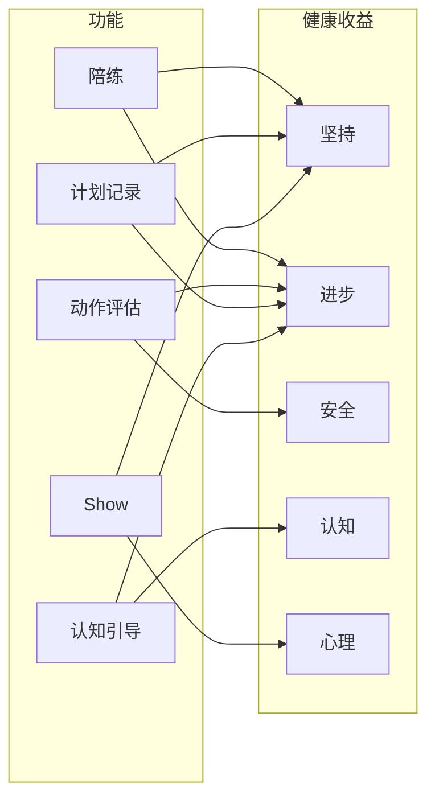

---

### 5.1 实时陪练

**价值**：训练过程中的陪伴、计时、调整、情绪价值，解决「一个人练无聊」的痛点。

**健康收益映射**：

| 健康维度 | 贡献路径 | 验证指标 |
|----------|----------|----------|
| **坚持** | 陪伴减少孤独感，计时/提醒减少放弃 | 单次训练完成率、中途退出率；有陪练 vs 无陪练的周完成次数对比 |
| **进步** | 实时调整（减组/换重量）避免过度或不足，保证有效训练 | 计划完成质量、容量达成率 |
| **心理** | 鼓励、认可带来正向情绪，增强动力 | 用户反馈、NPS |

**验证**：
- ✅ 需求真实：居家/健身房独自训练是主流场景
- ⚠️ 实现路径：先文本+计时，再语音，最后视频
- ⚠️ 依赖：需与「计划 + 记录」数据打通，否则上下文不足
- **待验证**：陪练是否显著提升「单次训练完成率」「周训练次数」——需 A/B 或前后对比

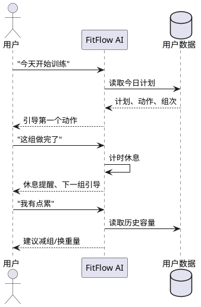

### 5.2 动作评估

**价值**：判断动作是否正确，给出纠正建议，替代部分线下私教职能。

**健康收益映射**：

| 健康维度 | 贡献路径 | 验证指标 |
|----------|----------|----------|
| **安全** | 纠正错误动作，降低受伤风险 | 受伤率（难直接测）、用户采纳纠正建议后的动作复测得分 |
| **进步** | 动作正确 → 目标肌群刺激到位 → 效果更好 | 与动作质量相关的容量/形体变化（需长期追踪） |

**验证**：
- ✅ 需求真实：动作错误是常见受伤原因，用户有纠错需求
- ⚠️ 实现难度：上传照片/视频（中）→ 语音唤醒+实时观看（高）→ 视频陪伴（很高）
- ⚠️ 竞品：FitnessAI 有 BodyScan，Planfit 等有动作库，需做出差异化（如与陪练结合）
- **待验证**：用户是否认为反馈「有用」；纠正后复测是否改善——可用问卷+二次上传验证

### 5.3 长久计划与记录

**价值**：为陪练、评估、Show 提供数据基础，是「数据驱动」的前提。

**健康收益映射**：

| 健康维度 | 贡献路径 | 验证指标 |
|----------|----------|----------|
| **坚持** | 有计划 = 有目标，减少「不知道练什么」的放弃 | 有计划用户的周活跃 vs 无计划用户 |
| **进步** | 记录容量/PR → 可量化进步 → 可持续调整计划 | 容量趋势、PR 增长、计划完成率 |
| **认知** | 饮食记录+目标 → 理解宏量、热量与形体的关系 | 饮食记录坚持率、目标达成率 |

**验证**：
- ✅ 必须做：没有数据，AI 就是普通聊天
- ✅ 已有 MVP：FitFlow 已有计划、记录、饮食、评估模块
- ⚠️ 需完善：数据与 Agent 的读写接口、结构化程度
- **健康验证**：计划+记录是「基础设施」，健康收益通过陪练、评估、认知引导间接体现；可追踪「有完整记录用户」的坚持率、进步率

### 5.4 Show 效果

**价值**：可分享的日历图、训练卡片、年终视频，满足展示与社交需求。

**健康收益映射**：

| 健康维度 | 贡献路径 | 验证指标 |
|----------|----------|----------|
| **坚持** | 分享 = 公开承诺，社交反馈强化动力；年终总结带来成就感 | 分享用户的续留率、分享后 30 日活跃 |
| **心理** | 可见的进步可视化，增强自信和满足感 | 用户反馈、分享意愿 |

**验证**：
- ✅ 需求真实：健身人群有强展示欲（朋友圈、小红书、抖音）
- ✅ 差异化：多数健身 App 偏工具，缺少「好看、可分享」的内容生成
- ⚠️ 设计挑战：风格、模板、一键生成需打磨
- **待验证**：Show 是否提升长期坚持——分享用户 vs 未分享用户的留存对比

### 5.5 训练搭子（社交）

**价值**：双人组队，AI 安排计划并陪练，将训练变为社交/约会场景。

**健康收益映射**：

| 健康维度 | 贡献路径 | 验证指标 |
|----------|----------|----------|
| **坚持** | 双人约定 = 承诺感，社交动力降低放弃率 | 搭子用户的周完成率 vs 单人用户 |
| **心理** | 共同体验、关系增进带来正向情绪 | 用户反馈、搭子功能使用频率 |

**验证**：
- ✅ 创意独特：市面上少见「双人 AI 陪练」
- ⚠️ 待验证：目标用户规模、使用频率、付费意愿；**健康收益**是否显著——需内测数据
- ⚠️ 实现复杂：需双人匹配、档期协调、共同会话

---

### 5.6 认知引导（跨功能能力）

> 来自共创者洞察：用户 6 年才意识到饮食+形体的重要性，**认知改变至关重要**。可作为陪练、计划中的贯穿能力，而非独立模块。

**健康收益映射**：

| 健康维度 | 贡献路径 | 验证指标 |
|----------|----------|----------|
| **认知** | 帮用户厘清真实目标，解释「为什么这样练/吃」 | 目标达成路径、用户自述理解程度 |
| **进步** | 少走弯路 → 更早进入正确轨道 → 长期效果更好 | 与认知阶段相关的进步速度（难量化，可访谈） |

**实现方式**：在陪练对话中穿插「阶段解释」；在计划调整时说明「为什么这样改」；建档时探询真实目标（减肥/形体/自信/社交）。

---

### 5.7 功能验证优先级（按健康收益）

以「健康收获」为核心，建议的验证顺序：

| 优先级 | 功能 | 核心健康收益 | 验证方式 | 依赖 |
|--------|------|--------------|----------|------|
| P0 | 计划+记录 | 坚持、进步（基础设施） | 有/无计划用户的活跃对比 | 已有 MVP |
| P0 | 陪练 | 坚持、进步 | 有/无陪练的完成率、周次数对比 | M1 数据打通 |
| P1 | 认知引导 | 认知、进步 | 访谈、目标达成路径分析 | 陪练+计划 |
| P1 | Show | 坚持、心理 | 分享用户 vs 未分享用户留存 | 记录数据 |
| P2 | 动作评估 | 安全、进步 | 反馈有用性问卷、纠正后复测 | 视觉能力 |
| P2 | 训练搭子 | 坚持、心理 | 内测、搭子 vs 单人完成率 | 陪练+双人逻辑 |

**原则**：优先验证对「坚持」和「进步」贡献最大的功能；这两项是用户能否长期收获健康的核心。

---

## 六、发展路径建议

### 6.1 阶段优先级（与 PRODUCT_SPEC 一致）

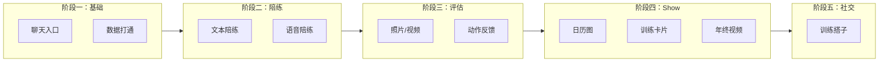

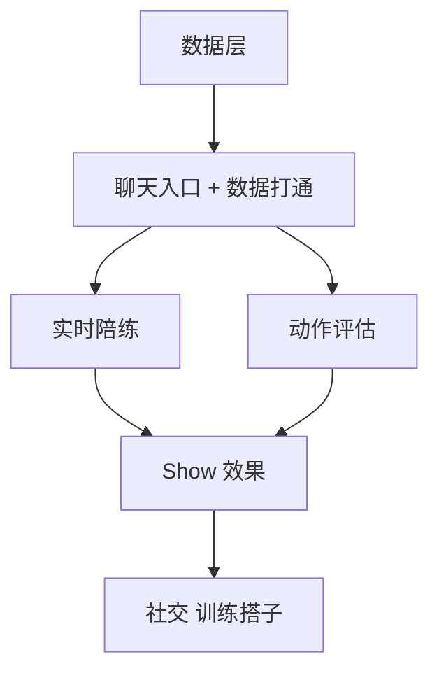

### 6.2 关键里程碑

| 里程碑 | 定义 | 验证目标 |
|--------|------|----------|
| M1：数据打通 | AI 能读、能写用户训练/饮食/评估数据 | 用户可通过对话完成计划调整、记录补充 |
| M2：陪练可用 | 用户说「今天开始训练」能获得引导、计时、调整 | 单次训练完整走通 |
| M3：Show 可分享 | 生成日历图/训练卡片，一键分享 | 用户主动分享到社交平台 |
| M4：动作评估 | 上传视频获得动作反馈 | 用户认为反馈有价值 |

### 6.3 建议的验证方式

1. **小范围内测**：找 10–20 位真实用户，完成 M1–M2，收集反馈
2. **Show 先行**：若陪练开发周期长，可先做 Show（依赖现有记录数据），快速验证分享意愿
3. **训练搭子**：用问卷/访谈验证需求，再决定是否投入开发

---

## 七、结论与下一步

### 7.1 Idea 验证结论

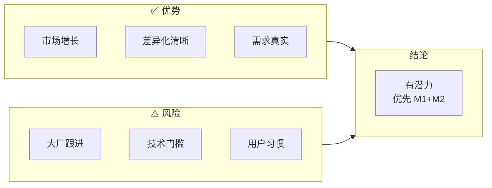

| 维度 | 结论 |
|------|------|
| 市场 | ✅ 市场在增长，AI 健身是明确方向 |
| 差异化 | ✅ 数据持久化 + 可执行决策 + 主动时机，与通用 AI 有清晰边界 |
| 竞品 | ⚠️ 大厂可能跟进，需加快数据与体验的积累 |
| 功能 | ✅ 陪练、评估、Show 需求真实；社交待验证 |
| 技术 | ⚠️ 动作评估、实时陪练有技术门槛，需分阶段实现 |

**总体**：这是一个有潜力的 idea，核心在于「数据 + 决策 + 主动」的差异化。建议优先完成数据打通和陪练 MVP，用真实用户验证价值，再决定 Show、评估、社交的投入节奏。

### 7.2 建议的下一步

1. **完成 M1（数据打通）**：确保 Agent 能稳定读写训练、饮食、评估数据
2. **设计陪练 MVP**：明确「今天开始训练」的完整流程，实现最小可用版本
3. **准备内测**：招募 10–20 位目标用户，设定验证指标（如：周活跃、完成训练次数）
4. **持续更新本文档**：每次讨论、验证结果、决策变更，在此追加记录

---

### 7.3 盈利途径

> 问题：FitFlow 的盈利途径是什么？

**竞品参考**：

| 模式 | 代表产品 | 说明 |
|------|----------|------|
| **订阅制** | FitnessAI、Shred、Fitbod、JuggernautAI | 月/年费，$10–35/月，持续收入 |
| **Freemium** | Keep、Hevy、Planfit | 免费基础 + 付费高级功能 |
| **一次性买断** | 训记 | 永久会员 ¥88，无持续收入 |
| **B2B** | 企业健康、健身房 | 批量授权 |
| **电商/增值** | 部分健身 App | 卖装备、补剂、课程 |

**FitFlow 可考虑的路径**：

| 路径 | 描述 | 优先级 |
|------|------|--------|
| **订阅制** | 月/年费，解锁陪练、主动提醒、动作评估、Show 等 | 主路径，与「持续服务」定位一致 |
| **Freemium** | 免费：基础陪练、计划、记录；付费：主动提醒、动作评估、Show、认知引导 | 降低门槛，用免费验证价值 |
| **按功能付费** | 动作评估、Show 生成等单次或包月 | 可作为订阅的补充 |
| **B2B** | 健身房、企业健康项目采购 | 中长期，需产品成熟后 |

**核心逻辑**：盈利依赖**用户健康收获**。若能证明 FitFlow 帮助用户坚持、进步，付费意愿自然产生。优先验证健康收益，再设计定价。

---

### 7.4 AI 准确性与客观性：能否做到？

> 问题：AI 教练能否保证准确、客观地评价用户并给出准确、客观的规划以达成目标？  
> 顾虑：A）AI 难达真值，正说正有理、反说反有理；B）健身除动作标准外，很难说有唯一正确答案。

#### 关于 A：AI 与「真值」

**现状**：LLM 是概率模型，无绝对真值，可正反皆辩。若纯靠 LLM 自由发挥，确实存在「怎么说都对」的风险。

**应对思路**：

| 策略 | 说明 |
|------|------|
| **数据优先** | 用用户真实数据（容量、PR、完成率、历史）驱动决策，而非纯 LLM 推理。如「根据你上周容量，建议这周减 10%」——有数据支撑 |
| **规则+模型** | 计划调整、容量计算等用规则/公式；LLM 负责理解意图、生成自然语言、处理边缘情况 |
| **原则锚定** | 将训练科学共识（渐进超负荷、恢复、周期化等）写进 prompt/知识库，约束输出不偏离主流 |
| **坦诚不确定性** | 在无共识处，明确说「基于你目前数据我建议 X；也有其他做法，可一起试」——不假装绝对正确 |

#### 关于 B：健身没有唯一正确答案

**共识**：除动作形式（有相对共识）外，训练方法（5×5、5/3/1、推/拉/腿等）并无唯一最优解，因人、因目标、因阶段而异。

**应对思路**：

| 策略 | 说明 |
|------|------|
| **目标+约束** | 不追求「正确答案」，而追求「在用户目标与约束下的合理方案」。如：增肌、每周 3 次、家里只有哑铃 → 给出可行方案 |
| **迭代优化** | 用「执行 → 记录 → 反馈 → 调整」闭环，根据用户实际表现迭代，而非一次性给出「终极方案」 |
| **透明表达** | 说明「这是基于你目标与数据的建议，可调整」；避免「你必须这样练」的绝对化表述 |
| **动作评估相对客观** | 动作形式（深度、轨迹、对称等）有相对共识，视觉模型可做客观评分；这是 FitFlow 可强调的「客观」部分 |

#### 总结

**不能保证**：AI 无法给出绝对正确、放之四海皆准的「真值」方案。

**可以做到**：在**数据驱动 + 原则锚定 + 迭代优化**下，给出**对当前用户合理、可执行、可验证**的方案；在动作评估上做到相对客观；在无共识处坦诚不确定性。

**产品叙事**：FitFlow 的定位是「基于你的数据与目标，给出合理方案并持续优化」，而非「给你唯一正确答案」。

---

## 八、共创者洞察：用户真实感受与发散思考

> 以下来自十年健身经历的真实感受，作为产品思考的输入。个人视角有其片面性，需与更广泛用户验证互补。

### 8.1 认知与目标弯路

**感受**：一开始是胖子，以为跑步就能减肥，初期体重降得快，但 6 年后才通过饮食让脸瘦削、才开始追求形体。以前是「五花肉」，目标走了很多弯路。最初目标其实不只是减肥，还有形体、自信、异性社交——若能更早意识到，会更好。**认知改变至关重要。**

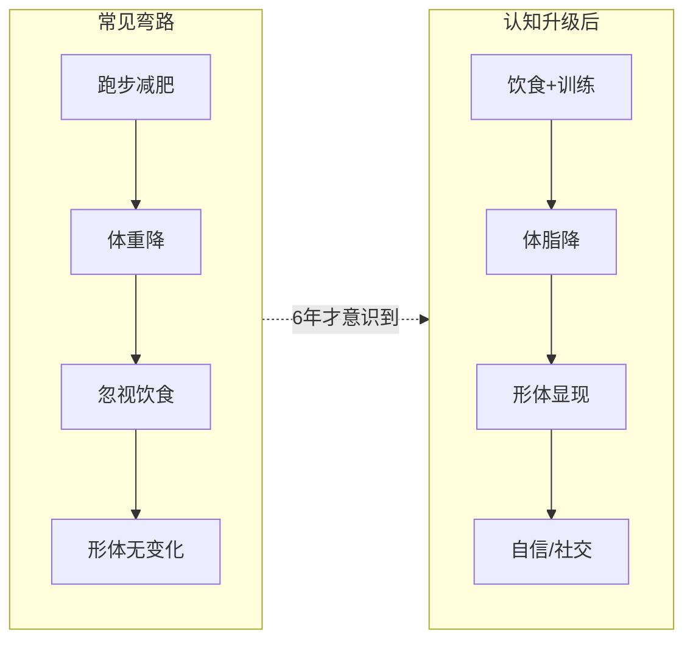

**发散思考**：

| 洞察 | 对 FitFlow 的启示 |
|------|-------------------|
| 用户目标往往是复合的（减肥+形体+自信+社交），但表达时可能只说「减肥」 | AI 可在建档/对话中主动探询真实目标，避免单一指标误导 |
| 认知滞后会导致多年弯路 | **认知引导**是差异化：不只给计划，还解释「为什么这样练/吃」「你处在什么阶段」 |
| 饮食认知往往晚于运动 | 饮食模块不能弱化，且应与训练联动呈现（如「你练腿日碳水可略高」） |
| 形体、自信、社交是深层动机 | Show、社交（训练搭子）不只是锦上添花，而是触及深层动机 |

**产品方向**：FitFlow 可增加「目标与认知」模块——帮用户厘清真实目标，并在训练/饮食中持续做「认知教育」，而不只是执行计划。

---

### 8.2 私教价格与 AI 的长期价值

**感受**：私教一节课两三百，很贵，但需求真实。不能一直办私教。AI 教练能**长期陪伴、维持数据、维持标准化服务**。

**发散思考**：

- 真人私教的**一次性指导**价值高（动作纠正、现场反馈），但**持续性**弱——课结束就结束。
- AI 的强项正是**持续性**：每天提醒、每周复盘、长期数据追踪、标准化流程不因教练换人而变。
- 理想形态可能是**混合**：关键节点（如入门、受伤后恢复）用真人；日常维持用 AI。

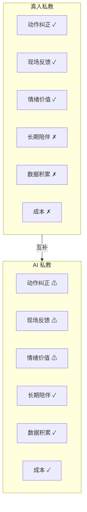

---

### 8.3 对 AI 私教效果的担忧

**感受**：担心 AI 在以下方面达不到真人水平——动作指导、饮食指导、情绪价值、监督训练。另外，部分真人私教存在「卖色相、主打陪伴」的需求，不确定这会影响多少。

**发散思考**：

| 能力 | AI 现状/潜力 | 真人 | 结论 |
|------|--------------|------|------|
| **动作指导** | 视觉模型可做基础纠正，但实时性、细节不如现场 | 强 | AI 可做 60–70 分，复杂动作仍建议真人 |
| **饮食指导** | 基于规则的宏量、餐次建议可标准化；个性化需数据 | 依赖教练水平 | AI 在标准化+数据驱动上有优势 |
| **情绪价值** | 文字/语音鼓励、认可可做；共情深度有限 | 强 | AI 可做基础陪伴，深度共情是短板 |
| **监督训练** | 提醒、打卡、数据追踪——AI 可 7×24 | 依赖教练责任心 | **监督是 AI 的强项**，真人难以持续 |
| **卖色相/陪伴** | 不涉及 | 部分用户为此付费 | 与「训练效果」是不同需求，可能分流一部分用户 |

**关于「卖色相、陪伴」**：

- 这确实是一部分健身房的现实，尤其面向特定人群的私教。
- 但**追求训练效果**的用户与**追求陪伴/颜值**的用户，需求不同、付费逻辑不同。
- FitFlow 的定位是「训练专家」——服务的是前者。后者可能不是目标用户，也不必强求覆盖。
- 若未来有「陪伴型」AI 健身产品（如虚拟形象、情感陪伴），那是另一条产品线，与 FitFlow 的「专业私教」定位可区分。

**总结**：AI 在动作、情绪上会有短板，但在**监督、数据、标准化、长期陪伴**上有优势。FitFlow 应明确「我们擅长什么、不擅长什么」，在擅长处做深，在短板处坦诚（如建议用户复杂动作找真人纠正）。

---

## 九、产品哲学：AI 是在摧毁人还是在服务人

> 由「AI 私教 vs 真人私教」引申出的终极问题。本文档不追求答案，而是记录思考框架，供产品决策时参考。

### 9.1 二元对立可能不成立

「摧毁 vs 服务」更像光谱，而非非此即彼：

- **服务**：提效、降本、填补空白（如 AI 私教让更多人负担得起指导）
- **摧毁**：替代岗位、削弱人际连接、放大偏见或依赖
- **现实**：同一技术往往同时带来两者，取决于谁在用、怎么用、在什么制度下用

更可操作的问题是：**在哪些场景里 AI 更偏向服务人，在哪些场景里更偏向伤害人？**

### 9.2 在 FitFlow 语境下的两面

| 视角 | 服务人 | 摧毁/削弱 |
|------|--------|-----------|
| **可及性** | 让付不起私教的人也能获得指导 | 可能挤压部分私教收入 |
| **陪伴** | 7×24 陪伴、监督、数据追踪 | 真人教练的面对面互动被稀释 |
| **认知** | 帮助更早建立正确认知，少走弯路 | 若设计不当，可能强化单一标准、忽视个体差异 |
| **关系** | 工具化、可随时开关，不绑架情感 | 若过度依赖，可能削弱自我管理能力 |

FitFlow 这类产品，更像是**在「服务人」这一侧做选择**：用 AI 补足真人私教贵、难持续的问题，而不是要取代人与人的关系。

### 9.3 更可操作的追问

与其问「AI 是在摧毁人还是在服务人」，不如问：

**「我们设计 AI 时，是在把人当作目的，还是当作手段？」**

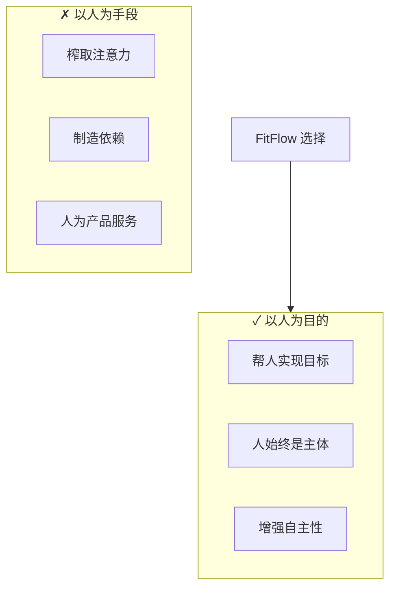

- **以人为目的**：AI 用来帮人更好实现自己的目标（健康、自信、社交等），人始终是主体
- **以人为手段**：AI 用来榨取注意力、制造依赖、放大焦虑，人为产品服务

FitFlow 的「认知引导」「长期陪伴」「数据驱动」若做得好，是更接近前者：帮人**更自主**地达成目标，而不是更依赖系统。

### 9.4 务实态度

「AI 到底是在摧毁人还是在服务人」——这个问题本身很难有终极答案，因为：

- 技术本身是中性的，使用方式和制度设计才决定方向
- 不同群体、不同场景，答案会不同
- 答案会随时间、社会共识、监管而变化

更实际的做法是：**在具体产品里，持续追问「我们是在服务人，还是在利用人？」**，并把这种追问写进产品原则和设计决策里。

---

## 附录：推销实验对话

> **实验设定**：健身老手（抵触 AI 教练 App，只用训记/Keep 记录） vs FitFlow 创始人（推销）。模拟真实对话，检验产品叙事能否打动 skeptical 用户。

---

**老手**：你搞的那个 AI 教练？说实话，这类 App 我都不太信。我练了好几年了，计划自己会排，动作自己会看视频学，最多用训记记一下容量，或者 Keep 看看动作库。什么 AI 私教、智能计划，感觉都是噱头。

**创始人**：我理解。你这种练了好几年的，确实不需要别人告诉你「深蹲怎么做」——你早就懂了。那我想问一句：你训记里的数据，除了自己回头看，还有谁在用？

**老手**：就我自己看啊，记完拉倒。偶尔看看容量趋势、PR，心里有数就行。

**创始人**：对。那假如有个东西，能**读**你训记里的数据——你上周练了多少、这周该不该减载、今天计划是啥——然后你训练的时候跟它说一句「这组做完了」「我有点累」，它直接帮你**写**进记录，还能根据你历史容量给建议「这周减 10% 吧」——这种你会觉得有用吗？还是依然觉得多此一举？

**老手**：嗯……写记录这个倒是省事。但「根据历史给建议」？我自己也会看啊，容量高了就减一点，这用 AI？

**创始人**：对，你肯定会。但问题是：**你每次训练都会认真看一遍上周数据再决定吗？** 很多人练到一半累了，懒得算，要么硬扛要么随便减——有个东西帮你算好、直接改计划，你少动脑，只负责练。这不是「教你怎么练」，而是「帮你把该做的决策做了」。

**老手**：那跟豆包问一句有啥区别？我也可以问豆包「我上周容量多少，这周该咋练」。

**创始人**：区别在这：豆包**不知道**你上周容量多少。你每次都得重新说「我上周练了腿，做了 5 组深蹲、4 组腿举……」——它没有你的数据。我们的逻辑是：你的训练、饮食、评估数据**一直在我们这儿**，你打开就能用，不用每次重新描述。你说「我有点累」，它调的是你**真实的历史记录**，不是你临时口述的。

**老手**：行，数据这块算你有道理。但你说「AI 教练」——我总觉得 AI 给的计划、建议，不如自己琢磨的靠谱。健身这事儿，每个人不一样，哪有标准答案？

**创始人**：我同意，没有标准答案。所以我们不卖「唯一正确答案」，我们卖的是「**基于你数据的合理方案**」。比如你目标是增肌、每周能练 4 次、家里只有哑铃——我们给你一个可行方案，你练几周，数据反馈说恢复不过来，我们再调。是**迭代**的，不是一次定死。而且动作评估那块，我们承认：复杂动作、细节纠正，AI 不如真人，该找教练还是找。我们擅长的是**数据、计划调整、提醒、记录**——这些真人教练没法 7×24 给你做。

**老手**：提醒？你是说那种「该训练了哦」的推送？我关了。烦。

**创始人**：可以关，没问题。我们设计的是：默认温和，你可以自定义时段，比如只在你常训练的时间段提醒。而且不是泛泛的「该运动了」，而是「今天按计划是练腿，你上次深蹲 80kg 做了 4 组」——带着你的数据来的。你不想用提醒就不用，但有的人确实会忘，有个东西推一把，完成率会高不少。

**老手**：那你觉得我这种人——自己会练、会记、不太信 AI——用你这东西，图啥？

**创始人**：坦白说，你这种用户我们不会强求。你已经有自己的节奏了。但有两个点可能对你有用：一，**省事**——记录不用手写，说一句就写进去，计划调整也可以对话搞定；二，**陪练**——一个人练的时候，有个东西能计时、能跟你说「休息够了，下一组」，偶尔给句鼓励，至少不无聊。你试试，如果觉得多余，不用就是了。我们更想服务的是：想好好练、但容易半途而废的人；或者刚开始、不知道咋排计划的人。你能自己搞定，我们替你高兴。

**老手**：行吧，听着没那么玄乎了。至少你没跟我说「AI 比真人教练强」那种话。

**创始人**：不会。我们很清楚：动作纠正、现场反馈、情绪价值，真人强。我们做的是真人**做不了**的——长期数据追踪、随时可用的计划调整、7×24 的提醒和记录。互补，不是替代。

**老手**：成，有机会我看看。但别指望我付费啊，训记 88 块永久我都没买，就用免费的。

**创始人**：哈哈，理解。我们也在想 Freemium——基础记录、陪练免费，高级功能再付费。你先用着，觉得有用再说。

---

**实验小结**：老手的抵触点（噱头、不如自己、没标准答案、推送烦）在对话中都有触及。创始人的应对主线：数据真实可用、可执行决策省事、不卖唯一答案、提醒可关、坦诚 AI 短板、不强求付费。老手未被完全说服，但态度从「都是骗人的」转为「有机会看看」——说明叙事有一定说服力，但 skeptical 用户转化仍需产品体验验证。

---

## 十、讨论记录（追加用）

> 以下为后续讨论的追加记录，按时间倒序。

### [2025-03-03] 推销实验对话

- 新增附录：模拟健身老手（抵触 AI 教练，只用训记/Keep 记录）与 FitFlow 创始人的推销对话
- 老手抵触点：噱头、不如自己、没标准答案、推送烦
- 创始人应对：数据真实、可执行省事、迭代非唯一答案、提醒可关、坦诚短板、不强求
- 结果：老手从「都是骗人的」→「有机会看看」

### [2025-03-03] 风险点展开

- 3.6 节从 4 条 bullet 扩展为 4 个风险专题
- **风险一**：大厂补齐数据+决策的动机、时间窗口、应对（抢时间、做深垂直、数据飞轮、考虑合作）
- **风险二**：动作评估/语音陪练的技术依赖、成本、分阶段策略
- **风险三**：用户从「问一句答一句」到「让 AI 主动管我」的心理、信任、习惯挑战及设计原则
- **风险四**：魔训 AI 教练定位为「计划+分析+线下私教」，与 FitFlow「AI 陪练」不同；若魔训增强 AI 能力会形成竞争
- 新增风险小结表（紧迫度+应对主线）及 Mermaid 图

### [2025-03-03] 竞品功能纵览对比表

- 新增 3.7 节：所有提及产品的功能纵览对比表
- 分四类：国际 AI 私教型、动作评估型、记录型+AI、国内
- 列维度：定价、计划生成、数据记录、动作评估、陪练/对话、可穿戴、特色卖点
- 补充特色卖点速查表（一句话核心卖点）

### [2025-03-03] 功能验证：以健康收获为核心

- **核心判断**：产品能否走远，取决于用户是否在健康上真正收获好处
- **新增 4.0**：验证原则、健康收益五维度（坚持/进步/安全/认知/心理）、功能→健康收益映射图
- **各功能补充**：健康收益映射表、验证指标、待验证项
- **新增 4.6**：认知引导（跨功能能力）
- **新增 4.7**：功能验证优先级表，按健康收益排序，P0 为计划+记录、陪练

### [2025-03-03] 文档头部脑图总览

- 新增「文档总览（脑图）」：在文档头部用 Mermaid mindmap 总结全部讨论要点（一至十章节核心内容）

### [2025-03-03] 盈利途径与 AI 准确性两个关键问题

- **7.3 盈利途径**：订阅制为主、Freemium 降门槛；核心逻辑是盈利依赖用户健康收获
- **7.4 AI 准确性与客观性**：A）AI 难达真值 → 数据优先、规则+模型、原则锚定、坦诚不确定性；B）健身无唯一答案 → 目标+约束、迭代优化、透明表达；定位为「合理方案+持续优化」而非「唯一正确答案」

### [2025-03-03] 关键要素置于文档首位

- **用户要求**：关键要素记载在文档最重要的位置
- **调整**：将「FitFlow 做出成绩的关键要素」移至文档首位，作为 **一、FitFlow 做出成绩的关键要素（核心）**
- **结构**：原 一→九 依次后移为 二→十；竞品章节内原 3.8 改为指向首节的简短说明

### [2025-03-03] FitFlow 做出成绩的关键要素

- **新增**：在竞品对比下，提炼 7 大关键成功要素
- **要素**：数据与对话深度打通、陪练场景体验、可执行决策、主动时机、健康收益可验证、垂直做深、速度
- **优先级**：P0 为数据打通+陪练+可执行；P1 为主动+健康验证；P2 为垂直做深；速度为贯穿
- **总结**：在「数据+陪练+可执行+主动」上做到可用且可验证，用健康收益证明价值，垂直做深，抢窗口期

### [2025-03-03] OpenClaw 等个人助理的竞争威胁

- **用户洞察**：相比豆包，更担心 OpenClaw 类产品——核心逻辑相同（个人助理，了解用户后帮助做事）
- **新增风险五**：OpenClaw 有持久记忆、可执行、主动、技能生态；已有 workout-logger、fitnesscoach-teneo、garmin-health-analysis 等健身技能
- **应对**：做深健身垂直、考虑 FitFlow 作为 OpenClaw 技能接入、专注健身专用叙事
- **竞品表**：新增 OpenClaw（个人助理型）

### [2025-03-03] 魔训 AI 教练定位澄清

- **用户澄清**：魔训搭子非核心，更关注魔训的 AI 教练定位
- **魔训核心**：双重专业指导——线上智能分析（计划+肌肉档案+数据）+ 线下真人私教。AI 为计划+分析工具，无对话陪练
- **与 FitFlow 差异**：魔训 = AI 当工具 + 真人当教练；FitFlow = AI 当陪练。风险四调整为关注魔训 AI 教练定位，非搭子心智

### [2025-03-03] 竞品补充：魔训、训记

- **魔训**（成都明意志）：核心为「双重专业指导」——线上智能分析（计划+肌肉档案）+ 线下真人私教。AI 是计划+分析工具，无对话陪练。搭子为附加功能。
- **训记**：力量训练硬核记录 App，容量计算、自定义计划、永久会员 ¥88，纯工具型无 AI。
- **新增**：3.5 魔训 AI 教练定位 vs FitFlow；能力对比表加入魔训、训记

### [2025-03-03] 竞品广泛调研

- **国际 AI 私教型**：FitnessAI、Planfit、Motra、Shred、JuggernautAI、SensAI、Fitbod、Freeletics、Whoop Coach
- **动作评估型**：Gymscore（计算机视觉 0–100 评分）
- **记录型+AI**：Hevy、Nike Training Club、Aaptiv
- **国内**：Keep（4 亿、AI 卡卡）、咕咚（2 亿、配速兔子）、悦跑圈、魔训、训记、豆包/千问
- **新增**：3.4 竞品能力对比表，从 FitFlow 视角对比 7 项能力

### [2025-03-03] AI 时代终极问题：摧毁人 vs 服务人

- **问题**：AI 到底是在摧毁人还是在服务人？
- **框架**：二元对立可能不成立，更可操作的是追问「以人为目的 vs 以人为手段」
- **FitFlow 立场**：选择「服务人」一侧，帮人更自主达成目标；在具体产品中持续追问「我们是在服务人，还是在利用人？」

### [2025-03-03] 共创者真实感受与发散思考

- **认知弯路**：十年健身经历，6 年才意识到饮食+形体的重要性；认知引导可作为 FitFlow 差异化（目标探询、阶段解释、认知教育）
- **私教价格**：真人私教贵且难持续，AI 的长期陪伴、数据积累、标准化是核心价值；理想形态可能是关键节点用真人、日常用 AI
- **效果担忧**：动作/情绪 AI 有短板，监督/数据/标准化 AI 有优势；「卖色相、陪伴」与训练效果是不同需求，FitFlow 聚焦后者即可

### [2025-03-03] 文档可视化迭代

- 新增 Mermaid 图表：产品定位对比、市场增长时间线、需求驱动思维导图、竞品定位矩阵、功能验证依赖、发展路径流程图、结论优势/风险图
- 整合「市场需求是否持续」讨论：补充 mindmap 展示支撑因素，明确结论为「是」

### [2025-03-03] 市场需求讨论

- **问题**：AI 健身教练/训练师是否持续增长和长期需求？
- **结论**：是。全球 AI 私教市场 CAGR 16–31%，国内线上健身 CAGR 28.5%，支撑因素包括成本可及性、个性化、技术成熟、健康意识
- **挑战**：用户留存（Keep 30 日约 54%）、免费内容竞争；FitFlow 的「数据+主动+决策」正是为解决留存设计

### [2025-03-03] 初版讨论

- 基于 PRODUCT_SPEC 完成产品定位回顾
- 补充市场趋势、竞品分析、功能验证
- 形成发展路径建议与验证结论
- 下一步：完成 M1 数据打通，设计陪练 MVP

---
